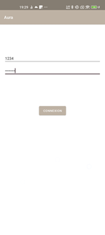
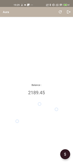
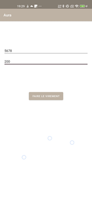

# A043_Aura  
  
	   
  
**OpenClassroom training:**  
Projet 4 - Mission - Accedez à des donnees externes pour une appli Kotlin 
  
[Link to the starter repository](https://github.com/OpenClassrooms-Student-Center/Acc-dez-des-donn-es-externes-pour-une-appli-en-Kotlin)  
  
[Link to the Openclassroom project](https://openclassrooms.com/fr/paths/527/projects/1636/164-mission---accedez-a-des-donnees-externes-pour-une-app-en-kotlin)  
  
[Link to the screen recorder](assets/screenRecorder/)
  
[Link to the UI tests report](assets/tests/)
  
  
### Objectives  
  
- [x] Add authentication system with Api login request on login screen
- [x] Fetch user account data from Api on home screen
- [x] Add account transfer system with Api transfer request on transfer screen
- [x] For all screens take into account loading, success and error paths
- [x] Perform all unit local tests